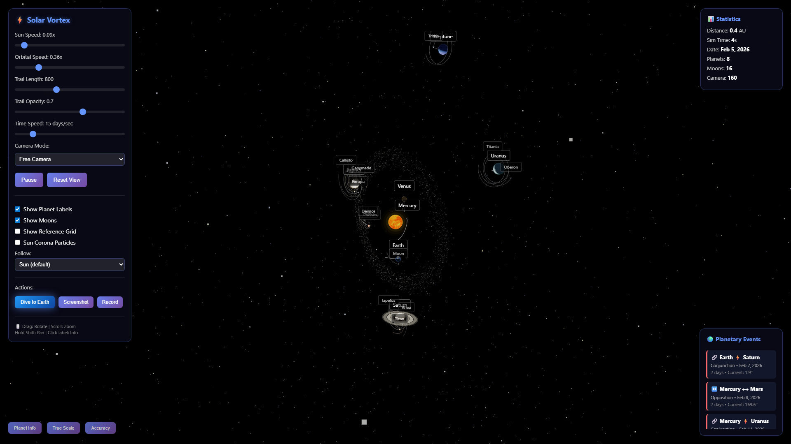

# Solar System Vortex Visualization

An interactive 3D visualization of the solar system showing planets orbiting the sun as it moves through space, creating beautiful helical vortex trails.



## Features

### 🌌 Visualization
- **8 planets** with accurate relative orbital speeds and colors
- **16 moons** orbiting their parent planets (Earth's Moon, Mars' Phobos & Deimos, Jupiter's Galilean moons, etc.)
- **Helical vortex trails** showing planetary paths through space
- **Enhanced 3D graphics** with realistic materials and lighting
- **10,000 star background** with depth and color variation
- **Reference grid** showing motion through the void

### 🎮 Interactive Controls
- **Sun Speed** - Adjust how fast the sun moves through space (0-5x)
- **Orbital Speed** - Control planetary orbital speeds (0-3x)
- **Trail Length** - Set trail history (100-2000 points)
- **Trail Opacity** - Adjust trail visibility (0.1-1.0)
- **Time Speed** - Control simulation speed (1-100 days/sec)

### 🌍 Planetary Events
- Real-time tracking of **conjunctions** (planets aligning)
- Real-time tracking of **oppositions** (planets on opposite sides)
- Precise dates and countdown timers
- Angular separation measurements
- Top 8 upcoming events displayed

### 📊 Real-Time Statistics
- Distance traveled (in AU)
- Simulation time elapsed
- Current simulation date (starts Feb 4, 2026)
- Total planets and moons
- Camera distance

### 🎛️ Toggle Options
- Show/hide planet labels
- Show/hide moons and their trails
- Show/hide reference grid
- Auto-follow sun through space
- Sun corona particle effects

## Technology Stack

- **Three.js** (r128) - 3D graphics rendering
- **Vanilla JavaScript** - No framework dependencies
- **HTML5 Canvas** - Hardware-accelerated rendering
- **CSS3** - Modern UI styling with glassmorphism

## Installation

### Option 1: Direct Use
Simply open `solar_vortex.html` in a modern web browser. No build process required!

### Option 2: Local Server
For best performance, serve via a local web server:

```bash
# Python 3
python -m http.server 8000

# Node.js
npx http-server

# PHP
php -S localhost:8000
```

Then navigate to `http://localhost:8000/solar_vortex.html`

## Embedding

### Simple iFrame
```html
<iframe 
    src="/path/to/solar_vortex.html" 
    style="width: 100%; height: 800px; border: none;"
    allowfullscreen>
</iframe>
```

### Full Page
Use `vortex_embed.html` for a standalone page with header and navigation.

### Card Component
Use `vortex_card.html` for integration into larger websites with info cards.

### React Component
Use `SolarVortex.jsx` for React/Next.js projects:

```jsx
import SolarVortex from './components/SolarVortex';

<SolarVortex 
  height="800px" 
  showHeader={true} 
  showInfo={true} 
/>
```

## Browser Compatibility

- ✅ Chrome 90+
- ✅ Firefox 88+
- ✅ Safari 14+
- ✅ Edge 90+
- ✅ Mobile browsers (iOS Safari, Chrome Mobile)

**Note:** WebGL support required

## Performance

- **60 FPS** on modern hardware
- **Optimized geometry** with LOD considerations
- **Efficient trail rendering** with configurable lengths
- **Responsive** - adjusts to window size

## Scientific Accuracy

### Orbital Periods (Earth days)
- Mercury: 88
- Venus: 225
- Earth: 365
- Mars: 687
- Jupiter: 4,333
- Saturn: 10,759
- Uranus: 30,687
- Neptune: 60,190

### Relative Speeds
Orbital speeds are scaled relative to Earth (1.0x) based on actual synodic periods.

### Planetary Events
Conjunction and opposition calculations use simplified two-body mechanics. Dates are estimates and may vary from actual astronomical events by several days.

## File Structure

```
solar-system/
├── solar_vortex.html       # Main visualization (standalone)
├── vortex_embed.html       # Full-page wrapper with header
├── vortex_card.html        # Card-style component
├── SolarVortex.jsx         # React component
└── README.md               # This file
```

## Controls Reference

### Mouse/Trackpad
- **Drag** - Rotate camera view
- **Scroll** - Zoom in/out
- **Shift + Drag** - Pan camera

### Keyboard Shortcuts
- **Space** - Pause/Resume
- **R** - Reset camera view

## Physics Model

The visualization demonstrates the **vortex theory** of solar system motion:
- The sun moves through space at constant velocity
- Planets orbit the sun in planes perpendicular to this motion
- Combined motion creates helical (spiral) paths through 3D space
- This produces the characteristic "vortex" pattern in planetary trails

## Future Enhancements

Potential additions:
- [ ] Asteroid belt
- [ ] Kuiper belt objects
- [ ] Saturn's rings
- [ ] Comet trajectories
- [ ] Spacecraft paths
- [ ] VR/AR mode
- [ ] Photo-realistic textures (when CORS-friendly sources available)
- [ ] Save/load camera positions
- [ ] Export screenshots/videos
- [ ] Sound effects

## Credits

Created by Cosmos Collective

Built with:
- [Three.js](https://threejs.org/) - 3D graphics library
- Orbital data from NASA/JPL
- Color palettes inspired by scientific imagery

## License

Private repository - All rights reserved

## Support

For questions or issues, please contact the development team.

---

**Made with 🌌 by Cosmos Collective**
